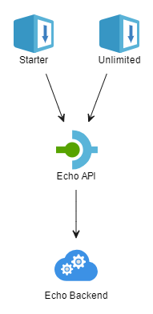
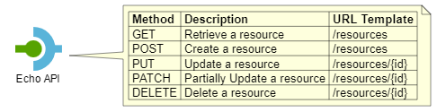
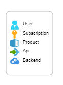
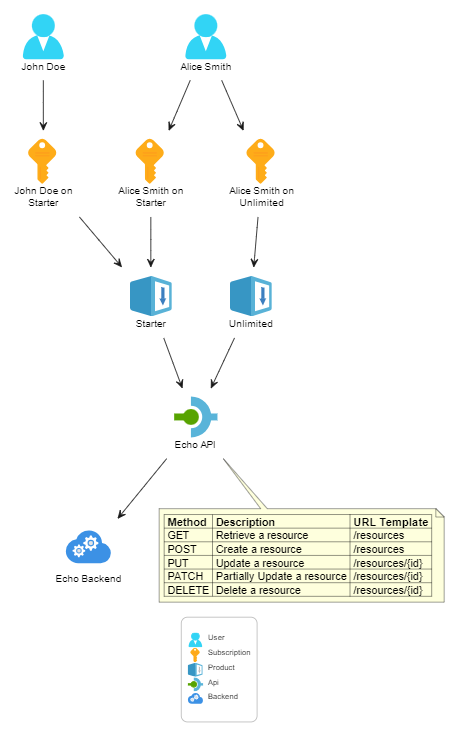
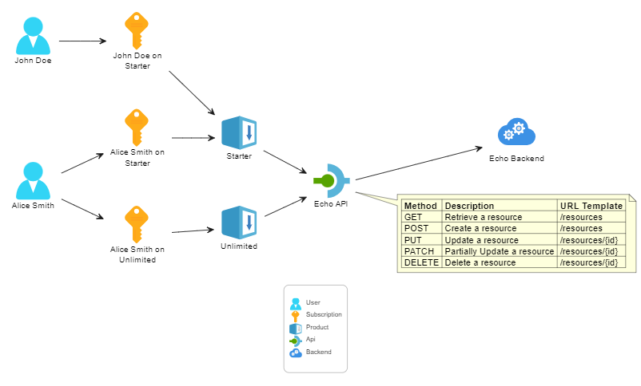

# Azure API Management PlantUML

This repository provides [PlantUML](https://plantuml.com/) sprites, macros, and stereotypes specifically designed for creating diagrams with [Azure API Management](https://azure.microsoft.com/products/api-management) components.

The [Azure-PlantUML](https://github.com/plantuml-stdlib/Azure-PlantUML) library includes symbols for a wide range of Azure services but does not cover the specific resources within Azure API Management. This project bridges that gap by providing the necessary visual elements.

With Azure API Management PlantUML, you can create visually distinct and recognizable diagrams for your API Management solutions.


## Content

- [Content](#content)
- [Getting Started](#getting-started)
- [Components](#components)
  - [Symbols](#symbols)
  - [API Operations](#api-operations)
  - [Legend](#legend)
  - [Sample Diagram](#sample-diagram)
- [Customizations](#customizations)
  - [Left to Right Direction](#left-to-right-direction)
  - [Raw Sprites](#raw-sprites)


## Getting Started

To use the Azure API Management symbols in your PlantUML diagrams, include the [ApiManagement.puml](./dist/v1/ApiManagement.puml) file at the top of your `.puml` file.

If you prefer to use the latest version directly from this repository, include the following line in your PlantUML diagram:

```
!include https://raw.githubusercontent.com/ronaldbosma/azure-apim-plantuml/refs/heads/main/dist/v1/ApiManagement.puml
```

Alternatively, you can download the `ApiManagement.puml` file locally and include it in your diagram using the following syntax:

```
!include path/to/ApiManagement.puml
```

Once you've included the `ApiManagement.puml` file, you can use the available macros to add API Management resources to your diagram. 
Here's an example of a PlantUML diagram that includes an API, two products, and a backend:

```
@startuml Hello World

!include https://raw.githubusercontent.com/ronaldbosma/azure-apim-plantuml/refs/heads/main/dist/v1/ApiManagement.puml

$ApimProduct(starterProduct, "Starter")
$ApimProduct(unlimitedProduct, "Unlimited")
$ApimAPI(echoApi, "Echo API")
$ApimBackend(echoBackend, "Echo Backend")

starterProduct --> echoApi
unlimitedProduct --> echoApi
echoApi --> echoBackend

@enduml
```

The diagram above will render as follows:




## Components

### Symbols

The following symbols are available in the current version of Azure API Management PlantUML:

| Resource | Symbol | Macro | Example Usage |
|-|-|-|-|
| API |  | `ApimAPI` | `$ApimAPI(alias, "label")` |
| Backend |  | `ApimBackend` | `$ApimBackend(alias, "label")` |
| Product |  | `ApimProduct` | `$ApimProduct(alias, "label")` |
| Subscription |  | `ApimSubscription` | `$ApimSubscription(alias, "label")` |
| User |  | `ApimUser` | `$ApimUser(alias, "label")` |

All macros take an `$alias` and `$label` as parameters. The `$alias` serves as a unique identifier for the resource and can be used to establish relationships between resources. The `$label` is the text displayed alongside the icon.


### API Operations

You can add operations to an API using the `ApimAPIOperation` macro. This macro renders the operations as a table inside a note attached to the API.

The macro takes the following parameters:

| Parameter | Description |
|-|-|
| `$api` | The alias of the API. |
| `$operations` | A JSON array of operations. Each operation should specify the `Method`, `Description` and `UrlTemplate`. |
| `$alignment` | The position of the note in relation to the API (default is `bottom`). |

Here's an example of how to add operations to an API:

```
@startuml Operations

!include https://raw.githubusercontent.com/ronaldbosma/azure-apim-plantuml/refs/heads/main/dist/v1/ApiManagement.puml

left to right direction

$ApimAPI(echoApi, "Echo API")

!$operations = [
    { "Method": "GET",    "Description": "Retrieve a resource",         "UrlTemplate": "/resources" },
    { "Method": "POST",   "Description": "Create a resource",           "UrlTemplate": "/resources" },
    { "Method": "PUT",    "Description": "Update a resource",           "UrlTemplate": "/resources/{id}" },
    { "Method": "PATCH",  "Description": "Partially Update a resource", "UrlTemplate": "/resources/{id}" },
    { "Method": "DELETE", "Description": "Delete a resource",           "UrlTemplate": "/resources/{id}" }
]
$ApimOperations(echoApi, $operations, "right")

@enduml
```

The diagram above will render as follows:



### Legend

You can add a legend to your diagram to explain the different symbols using the `ApimLegend` macro. This helps to clarify the meaning of each symbol used in your API Management diagram.

The macro takes the following parameters:

| Parameter | Description |
|-|-|
| `$includeUser` | Include the User symbol in the legend (default is `true`). |
| `$includeSubscription` | Include the Subscription symbol in the legend (default is `true`). |
| `$includeProduct` | Include the Product symbol in the legend (default is `true`). |
| `$includeAPI` | Include the API symbol in the legend (default is `true`). |
| `$includeBackend` | Include the Backend symbol in the legend (default is `true`). |
| `$alignment` | The position of the legend (default is `""`). |

Here's an example of how to add a legend to your diagram with all symbols:

```
@startuml Legend

!include https://raw.githubusercontent.com/ronaldbosma/azure-apim-plantuml/refs/heads/main/dist/v1/ApiManagement.puml

$ApimSymbolLegend()

@enduml
```

The diagram above will render as follows:



If you want to exclude certain symbols from the legend, you can do so by setting the corresponding parameter to `false`.  Here's an example of how to exclude the User and Subscription symbols, and place the legend at the top of the diagram:

```
$ApimSymbolLegend($includeUser=%false(), $includeSubscription=%false(), $alignment="top")
```


### Sample Diagram

Here's an example of a PlantUML diagram that includes all the available components:

```
@startuml All Components - Top Down

!include https://raw.githubusercontent.com/ronaldbosma/azure-apim-plantuml/refs/heads/main/dist/v1/ApiManagement.puml

' Users
$ApimUser(johnDoe, "John Doe")
$ApimUser(aliceSmith, "Alice Smith")

' Subscriptions
$ApimSubscription(johnDoe_StarterSubscription, "John Doe on Starter")
$ApimSubscription(aliceSmith_StarterSubscription, "Alice Smith on Starter")
$ApimSubscription(aliceSmith_UnlimitedSubscription, "Alice Smith on Unlimited")

' Products
$ApimProduct(starterProduct, "Starter")
$ApimProduct(unlimitedProduct, "Unlimited")

' APIs
$ApimAPI(echoApi, "Echo API")

' Backends
$ApimBackend(echoBackend, "Echo Backend")

' Operations
!$operations = [
    { "Method": "GET",    "Description": "Retrieve a resource",         "UrlTemplate": "/resources" },
    { "Method": "POST",   "Description": "Create a resource",           "UrlTemplate": "/resources" },
    { "Method": "PUT",    "Description": "Update a resource",           "UrlTemplate": "/resources/{id}" },
    { "Method": "PATCH",  "Description": "Partially Update a resource", "UrlTemplate": "/resources/{id}" },
    { "Method": "DELETE", "Description": "Delete a resource",           "UrlTemplate": "/resources/{id}" }
]
$ApimOperations(echoApi, $operations)


' Relationships
johnDoe --> johnDoe_StarterSubscription
johnDoe_StarterSubscription --> starterProduct

aliceSmith --> aliceSmith_StarterSubscription
aliceSmith_StarterSubscription --> starterProduct

aliceSmith --> aliceSmith_UnlimitedSubscription
aliceSmith_UnlimitedSubscription --> unlimitedProduct

starterProduct --> echoApi
unlimitedProduct --> echoApi
echoApi --> echoBackend


' Legend
$ApimSymbolLegend()

@enduml
```

The diagram above will render as follows:




## Customizations

### Left to Right Direction

By default, PlantUML diagrams are rendered from top to bottom. In some cases, it might be more convenient to render the diagram from left to right. You can achieve this by adding the following line at the top of your PlantUML file:

```
left to right direction
```

When rendering the diagram from left to right, you might also want to adjust the alignment of the operations. You can do this by setting the `$alignment` parameter of the `ApimOperations` macro. For example, to align the operations to the right of the API:

```
$ApimOperations(echoApi, $operations, "right")
```

Here's an example of a PlantUML diagram that renders from left to right:

```
@startuml All Components - Left to Right

!include https://raw.githubusercontent.com/ronaldbosma/azure-apim-plantuml/refs/heads/main/dist/v1/ApiManagement.puml

left to right direction

' Users
$ApimUser(johnDoe, "John Doe")
$ApimUser(aliceSmith, "Alice Smith")

' Subscriptions
$ApimSubscription(johnDoe_StarterSubscription, "John Doe on Starter")
$ApimSubscription(aliceSmith_StarterSubscription, "Alice Smith on Starter")
$ApimSubscription(aliceSmith_UnlimitedSubscription, "Alice Smith on Unlimited")

' Products
$ApimProduct(starterProduct, "Starter")
$ApimProduct(unlimitedProduct, "Unlimited")

' APIs
$ApimAPI(echoApi, "Echo API")

' Backends
$ApimBackend(echoBackend, "Echo Backend")

' Operations
!$operations = [
    { "Method": "GET",    "Description": "Retrieve a resource",         "UrlTemplate": "/resources" },
    { "Method": "POST",   "Description": "Create a resource",           "UrlTemplate": "/resources" },
    { "Method": "PUT",    "Description": "Update a resource",           "UrlTemplate": "/resources/{id}" },
    { "Method": "PATCH",  "Description": "Partially Update a resource", "UrlTemplate": "/resources/{id}" },
    { "Method": "DELETE", "Description": "Delete a resource",           "UrlTemplate": "/resources/{id}" }
]
$ApimOperations(echoApi, $operations, "right")


' Relationships
johnDoe --> johnDoe_StarterSubscription
johnDoe_StarterSubscription --> starterProduct

aliceSmith --> aliceSmith_StarterSubscription
aliceSmith_StarterSubscription --> starterProduct

aliceSmith --> aliceSmith_UnlimitedSubscription
aliceSmith_UnlimitedSubscription --> unlimitedProduct

starterProduct --> echoApi
unlimitedProduct --> echoApi
echoApi --> echoBackend


' Legend
$ApimSymbolLegend()

@enduml
```

The diagram above will render as follows:




### Raw Sprites

If you prefer to use raw SVG sprites in your PlantUML diagrams, you can include them directly. This allows for more flexibility in customizing the appearance of your components. Here's the same example from the getting started section that includes an API, two products, and a backend:

```
@startuml Hello World with Sprites

!include https://raw.githubusercontent.com/ronaldbosma/azure-apim-plantuml/refs/heads/main/dist/v1/ApiManagement.puml

rectangle "<$ApimProductSprite>\nStarter" <<ApimProduct>> as starterProduct
rectangle "<$ApimProductSprite>\nUnlimited" <<ApimProduct>> as unlimitedProduct
rectangle "<$ApimAPISprite>\nEcho API" <<ApimAPI>> as echoApi
rectangle "<$ApimBackendSprite{scale=3}>\nEcho Backend" <<ApimBackend>> as echoBackend

starterProduct --> echoApi
unlimitedProduct --> echoApi
echoApi --> echoBackend

@enduml
```